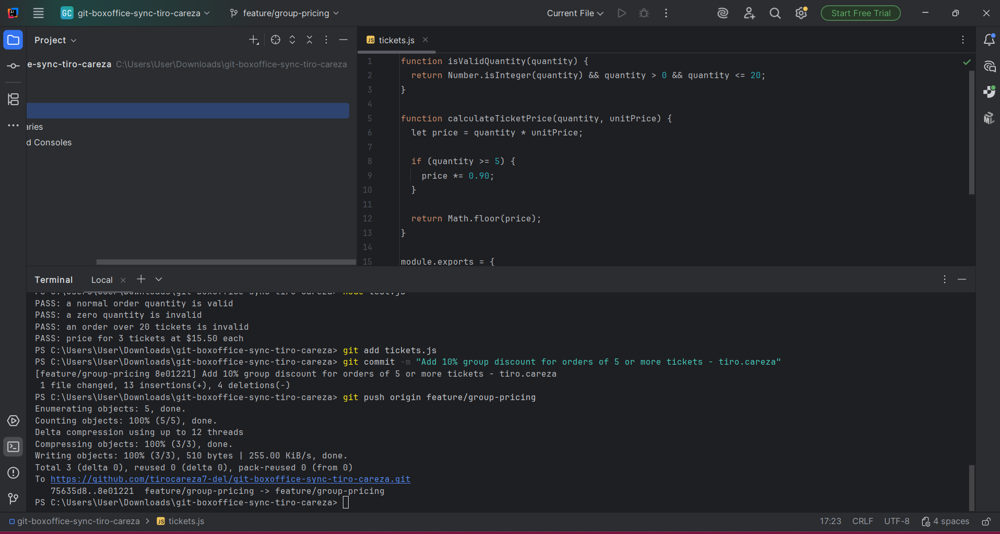
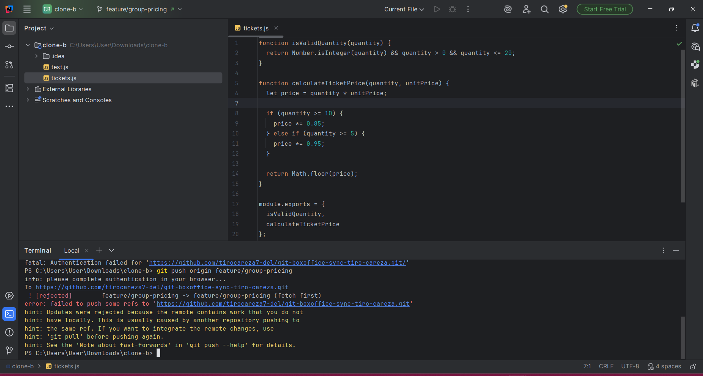
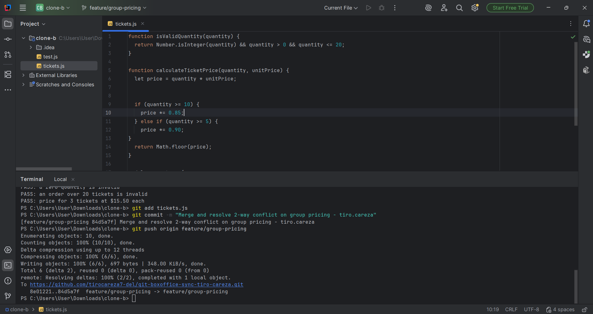
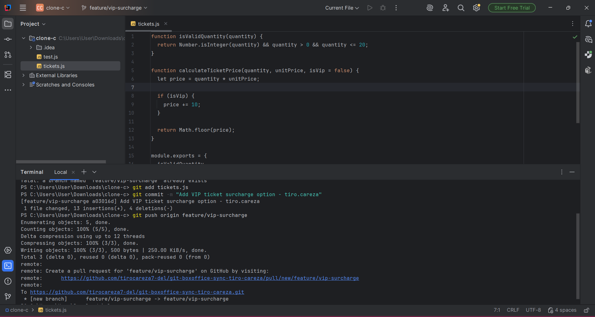
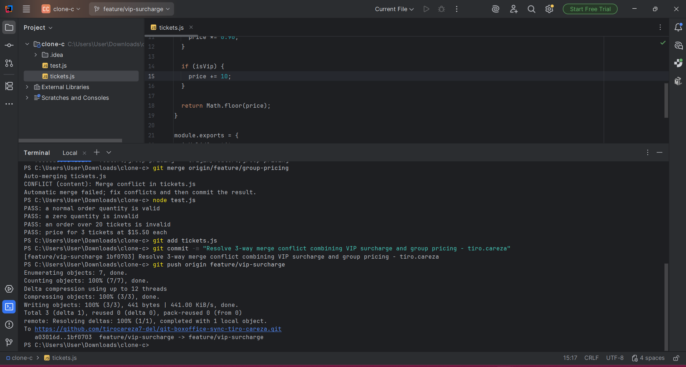
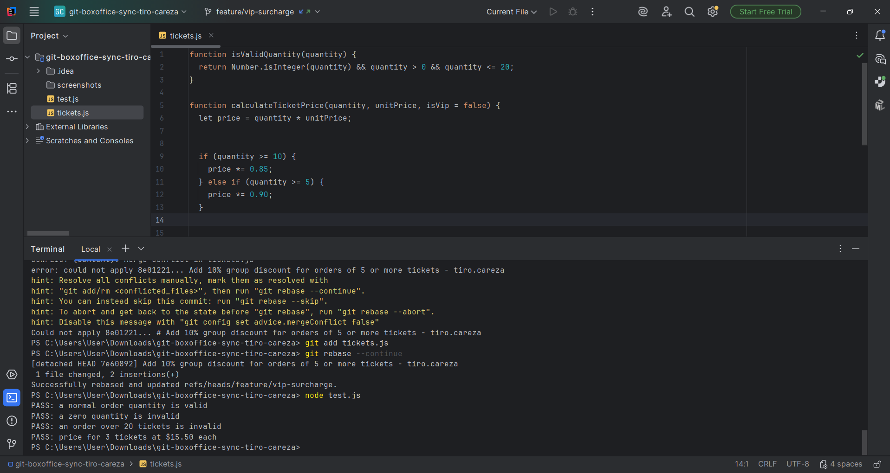
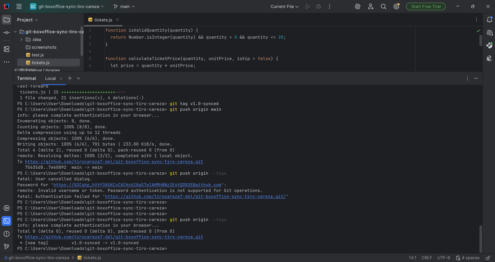

# Multi-Contributor Git Workflow Simulation Report

**Student / Contributor:** Tiro Careza
**Repository:** https://github.com/tirocareza7-del/git-boxoffice-sync-tiro-careza

---

## Reflection & Reasoning Questions

### 1. Why was the push rejected in Task 2, and how does Git protect central branches from accidental overwrites?
The push in Task 2 was rejected because Clone B's local branch had diverged from the remote `origin/feature/group-pricing` branch. Remote history contained commits that Clone B did not have locally. Git prevents fast-forward pushes in these scenarios to protect against overwriting or clobbering commits pushed by other contributors. Developers are forced to fetch, pull, and reconcile differences locally before updating the shared remote history.

### 2. Compare the 3-way merge in Task 5 with the rebase in Task 6. What are the advantages and trade-offs of each strategy?
- **3-Way Merge (Task 5):**
    - *Advantages:* Preserves the exact historical sequence of commits across feature branches, providing a clear audit trail of when branches diverged and merged.
    - *Trade-offs:* Creates extra merge commit nodes, which can make the git graph cluttered and harder to read in large teams.
- **Rebase (Task 6):**
    - *Advantages:* Re-applies local commits on top of the target base branch, creating a clean, linear commit history that is easy to follow and bisect.
    - *Trade-offs:* Rewrites commit history. If applied to shared public branches without caution, it can break team synchronization.

### 3. How did you verify that all four business rules were active and non-conflicting after the rebase?
After resolving merge conflicts during the rebase in `tickets.js`, I executed unit test scripts (`node test.js`). I verified that all four distinct rules executed correctly: ticket quantity validation, the 10% group discount for 5–9 tickets, the 15% tier for 10+ tickets, and the flat $10 VIP surcharge. All assertion tests passed without breaking existing rules.

### 4. What step in this workflow was most likely to cause silent bugs in a real team environment, and how can teams prevent them?
The most error-prone step is manual merge conflict resolution during 3-way merges or rebases (Tasks 3, 5, and 6). When combining divergent logic, developers might manually select code snippets incorrectly or drop boundary condition logic without triggering a syntax error. Teams can prevent silent bugs by enforcing robust automated CI/CD test suites that run on every pull request, requiring thorough peer code reviews, and maintaining comprehensive test coverage.

---

## Task Execution & Evidence

### Task 1: Initial Feature Branch Development (Clone A)
- Implemented 10% group discount for 5+ tickets in `tickets.js`.
- Verified logic with `node test.js` and pushed `feature/group-pricing`.

### Task 2: Parallel Feature Modification & Rejected Push (Clone B)
- Introduced divergent 15% discount logic in `clone-b`.
- Direct push rejected due to non-fast-forward divergence.

### Task 3: 2-Way Conflict Resolution & Sync (Clone B)
- Executed `git pull`, resolved `tickets.js` conflict (15% for 10+, 10% for 5-9 tickets).
- Verified tests passed and successfully pushed.

### Task 4: Parallel Contributor C Development (Clone C)
- Developed flat $10 VIP surcharge in `clone-c` on `feature/vip-surcharge`.
- Pushed branch to remote repository.

### Task 5: 3-Way Merge Resolution (Clone C)
- Merged `feature/group-pricing` into `feature/vip-surcharge`.
- Resolved 3-way conflict in `tickets.js`, verified tests passed, and pushed.

### Task 6: Rebase Reconciliation (Clone A)
- Rebased `feature/vip-surcharge` onto `main`.
- Resolved rebase content conflict, staged fixes, completed rebase without forced push.

### Task 7: Main Release Integration & Tagging (Clone A)
- Fast-forward merged `feature/vip-surcharge` into `main`.
- Tagged release `v1.0-synced` and pushed `main` and `--tags`.

